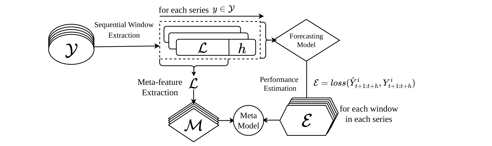
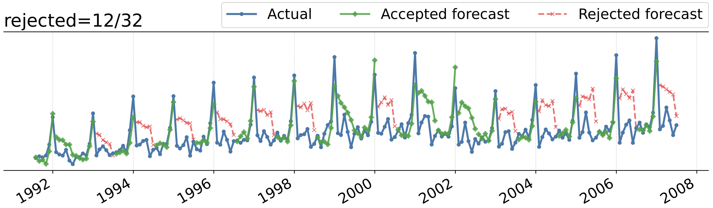

# Selective Time Series Forecasting via Metalearning

This repository contains a reject-option pipeline for time series forecasting. It trains a forecasting model on a source dataset, builds window-level meta-features, learns a metamodel that estimates risk of forecast error, and then uses that estimate to selectively accept or reject forecasts on a target dataset.



The methodology follows the diagram above: each time series is split into sequential windows, a forecasting model predicts the next horizon `h` on each, the realized error is measured, and meta-features are extracted from the context window. The metamodel learns the relationship between the window description and the expected forecast error.



The online example above shows the final use case: forecasts are produced sequentially, the metamodel scores each forecast window, and high-risk windows are rejected. In this example, the plot distinguishes the actual values, accepted forecasts, and rejected forecasts.

## Installation

The dependencies listed in `requirements.txt` are:

```text
catboost==1.2.10
datasets==4.5.0
datasetsforecast==1.0.0
dotenv==0.9.9
gluonts==0.16.2
huggingface_hub==1.3.2
joblib==1.5.1
matplotlib==3.10.5
metaforecast==0.1.1
mlforecast==1.0.2
neuralforecast==3.1.4
numpy==2.1.3
optuna==4.6.0
pandas==2.3.1
scikit-learn==1.8.0
scipy==1.15.3
shap==0.51.0
statsforecast==2.0.3
tsfeatures==0.4.5
tsfel==0.2.0
utilsforecast==0.2.15
```

## Run The Full Pipeline

From the project directory, this command enables the main optional features: both forecasting backbones, feature standardization, metamodel tuning, SHAP plots, online rejection plots, and saved model artifacts.

```powershell
python .\pipeline.py `
  --outdir reject_transfer_results_full `
  --ds1_data M3 `
  --ds1_group Monthly `
  --ds2_data M1 `
  --ds2_group Monthly `
  --forecast_models AutoKAN AutoNHITS `
  --horizon 12 `
  --meta_lags 18 `
  --fs 1 `
  --input_mult 2 `
  --start_padding_enabled `
  --meta_model catboost `
  --standardize_features `
  --tune_meta `
  --compute_shap `
  --online_qs 0.05 0.1 0.2 0.3 0.4 `
  --online_n_example_series 5 `
  --save_model_artifacts `
  --seed 0
```

Because two forecasting models are requested, the pipeline writes one run per model:

```text
reject_transfer_results_full/AutoKAN/
reject_transfer_results_full/AutoNHITS/
reject_transfer_results_full/multi_forecast_model_manifest.json
```

## Online Example

The figure `intro.png` corresponds to the sequential abstention part of the pipeline. The relevant options are:

```powershell
--online_qs 0.05 0.1 0.2 0.3 0.4 --online_n_example_series 5
```

Each `q` is a target rejection fraction. For example, `q=0.3` asks the online policy to reject roughly the riskiest 30 percent of forecast windows according to the calibrated metamodel score. The generated online artifacts are saved under each model run, for example:

```text
reject_transfer_results_full/AutoKAN/plots/online_plots/
reject_transfer_results_full/AutoKAN/ds2_adapted_online_*_summary.csv
reject_transfer_results_full/AutoKAN/plots/online_plots/summary/
reject_transfer_results_full/AutoKAN/plots/online_plots/forecast_windows/
```

The forecast-window plots use the same interpretation as `intro.png`: accepted forecasts are kept for downstream use, while rejected forecasts are flagged as too uncertain or error-prone.

## Pipeline Stages

1. Source forecasting stage

   The pipeline loads DS1, splits it into train/test portions, trains a NeuralForecast model (`AutoKAN` and/or `AutoNHITS`), and runs cross-validation on the source training data. It also computes a seasonal naive baseline when `statsforecast` is available.

2. Source meta-data construction

   Cross-validation forecasts are converted into complete forecast windows. For each window, the pipeline computes the realized window error, mainly window-level sMAPE, and extracts TSFEL features from the preceding context window of length `--meta_lags`.

3. Target meta-data construction

   The trained DS1 forecaster is applied to DS2 in a transfer setting. The target dataset must have a compatible frequency or group with DS1, such as Monthly to Monthly. The pipeline builds target windows, target errors, TSFEL features, and uncertainty baseline scores.

4. Reject metamodel training

   A meta-regressor is trained to predict the empirical percentile of the forecast error. The default metamodel is CatBoost. With `--tune_meta`, the meta-regressor is tuned using randomized search.

5. Selective rejection evaluation

   The metamodel scores forecast windows and rejects the windows with the highest predicted error risk. The pipeline evaluates rejection curves for in-domain source holdout, zero-shot transfer to DS2, and a target-domain adapted/oracle variant.

6. Online target-domain adaptation

   When `--online_qs` is provided, DS2 windows are split temporally into fit, calibration, and evaluation windows. The online policy calibrates thresholds for each requested `q` and produces summary CSVs plus plots of cumulative error, error distributions, and accepted/rejected forecast windows.

7. SHAP analysis

   With `--compute_shap`, the pipeline writes global SHAP summary plots and feature-importance CSV files for the trained reject metamodels.

## Main Arguments

- `--ds1_data`, `--ds1_group`: source dataset and group.
- `--ds2_data`, `--ds2_group`: target dataset and group.
- `--ds*_csv_path`, `--ds*_id_col`, `--ds*_ds_col`, `--ds*_value_col`: use custom CSV datasets instead of built-in datasets.
- `--forecast_models`: one or more forecasting models, currently `AutoKAN` and `AutoNHITS`.
- `--horizon`: forecast horizon `h`.
- `--meta_lags`: context length used for meta-feature extraction.
- `--fs`: sampling frequency passed to TSFEL feature extraction.
- `--input_mult`: NeuralForecast input size multiplier; input size is `input_mult * horizon`.
- `--start_padding_enabled`: allow NeuralForecast start padding for shorter prefixes.
- `--meta_model`: reject metamodel, default `catboost`.
- `--standardize_features`: standardize TSFEL/meta-features before metamodel training.
- `--tune_meta`: tune the metamodel hyperparameters.
- `--compute_shap`: save SHAP plots and feature-importance files.
- `--online_qs`: rejection fractions for the online target-domain evaluation.
- `--save_model_artifacts`: save trained forecasters and metamodel bundles.
- `--seed`: random seed.

## Outputs

Each run writes a JSON result file named like:

```text
results_<DS1>_to_<DS2>_H<horizon>_L<meta_lags>_reject.json
```

The output directory also contains plots, online summaries, optional SHAP files, and optional model artifacts:

```text
<outdir>/
  plots/
  models/
  results_*.json
  ds2_adapted_online_*_summary.csv
```
